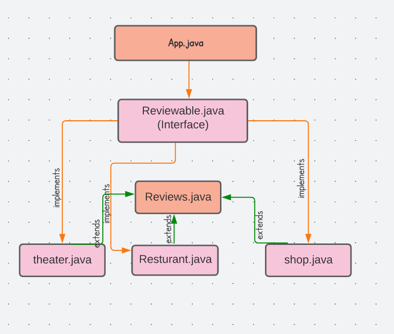

# Overview
Our website, Zelp, is growing like crazy! Users are no longer satisfied with only reviewing restaurants: they also want to review shops, movie theaters, and museums.
in this library.

# Installation
* open your terminal

* Clone the repo
* https://github.com/mariamodat/java-fundamentals2.git

# Architecture
# UML diagram

